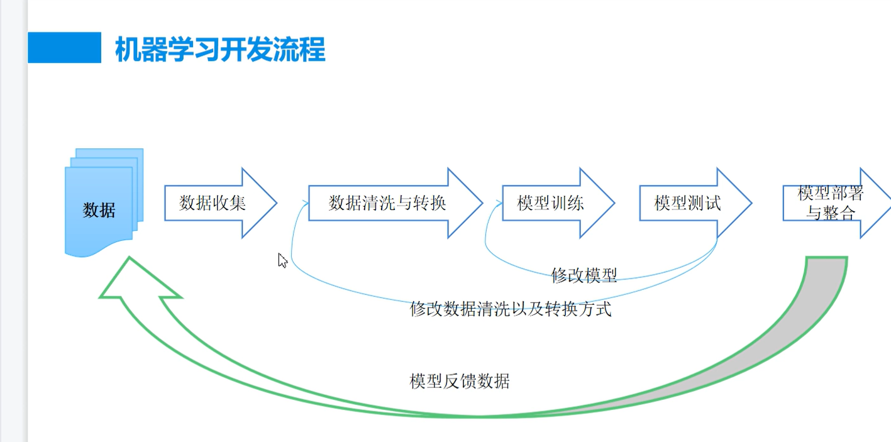
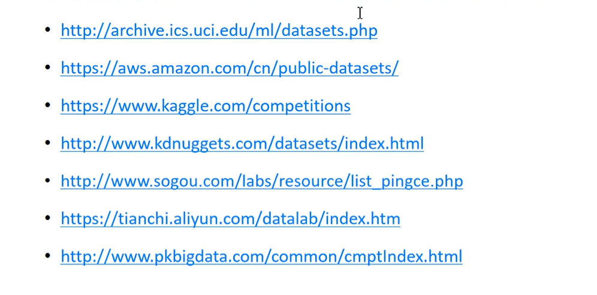
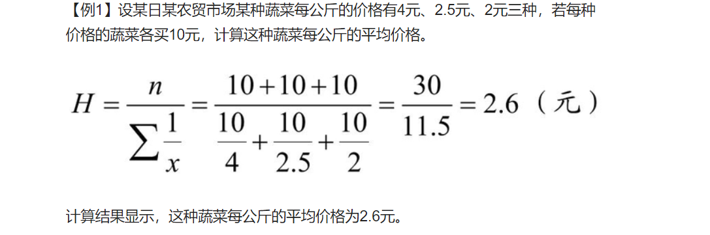
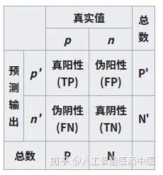
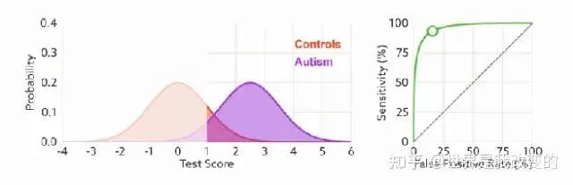
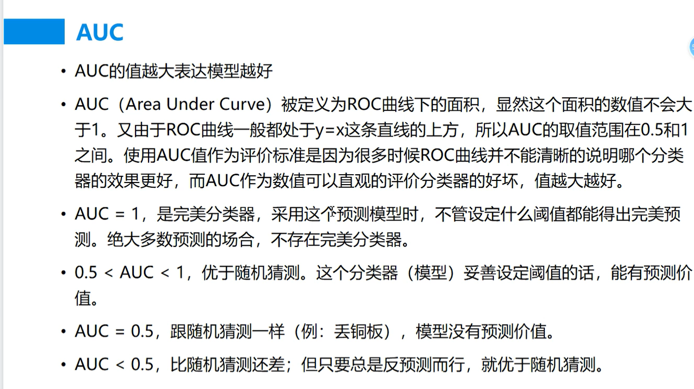
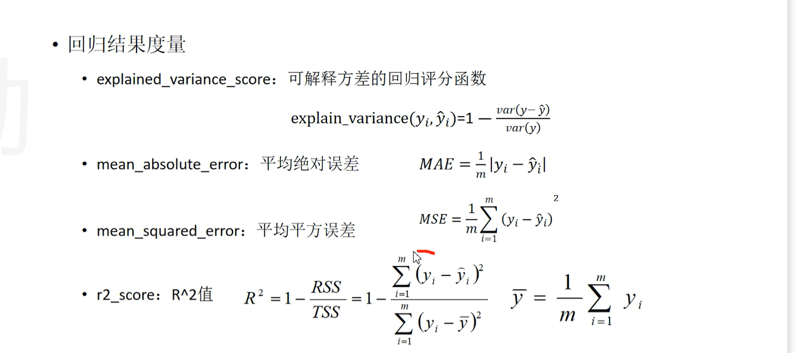

1、机器学习开发流程

2、公开用数据集

### 3、召回率和精度，调和平均值
一个数据库有500个文档，其中有50个文档符合定义。系统检索到75个文档，但是实际只有45个符合定义。则:

召回率R=45/50=90%
精度P=45/75=60%

本例中，系统检索是比较有效的，召回率为90%。但是结果有很大的噪音，有近一半的检索结果是不相关。 研究表明:在不牺牲精度的情况下，获得一个高召回率是很困难的。

对于一个检索系统来讲，召回率和精度不可能两全其美:召回率高时，精度低，精度高时，召回率低。所以常用11种召回率下11种精度的平均值来衡量一个检索系统的精度。我们也可以将这两个度量值融合成一个度量值，如F度量(F-measure)。对于搜索引擎系统来讲，因为没有一个搜索引擎系统能够搜集到所有的WEB网页，所以召回率很难计算。

调和平均值，每次购买固定金额的菜的平均数

### 4、混淆矩阵：
https://blog.csdn.net/qq_34807908/article/details/82024247
https://zhuanlan.zhihu.com/p/549835162
真阳性(TP)：诊断为有，实际上也有高血压。
伪阳性（FP）：诊断为有，实际却没有高血压。
真阴性（TN）：诊断为没有，实际上也没有高血压。
伪阴性（FN）：诊断为没有，实际却有高血压。
灵敏度（Sensitivity） = TP/(TP+FN)
特异度（Specificity） = TN/(FP+TN)

真正率（TPR） = 灵敏度 = TP/(TP+FN)
假正率（FPR） = 1- 特异度 = FP/(FP+TN)

### 5、Roc曲线
ROC曲线中的主要两个指标就是真正率和假正率，上面也解释了这么选择的好处所在。其中横坐标为假正率（FPR），纵坐标为真正率（TPR），下面就是一个标准的ROC曲线图。ROC曲线的阈值问题与前面的P-R曲线类似，ROC曲线也是通过遍历所有阈值来绘制整条曲线的。如果我们不断的遍历所有阈值，预测的正样本和负样本是在不断变化的，
相应的在ROC曲线图中也会沿着曲线滑动。
如何判断ROC曲线的好坏？
**改变阈值只是不断地改变预测的正负样本数，即TPR和FPR，**
但是曲线本身是不会变的。那么如何判断一个模型的ROC曲线是好的呢？
这个还是要回归到我们的目的：FPR表示模型虚报的响应程度，而TPR表示模型预测响应的
覆盖程度。我们所希望的当然是：虚报的越少越好，覆盖的越多越好。
所以总结一下就是TPR越高，同时FPR越低（即ROC曲线越陡），那么模型的性能就越好。

### 6、模型评估
