1、机器学习开发流程
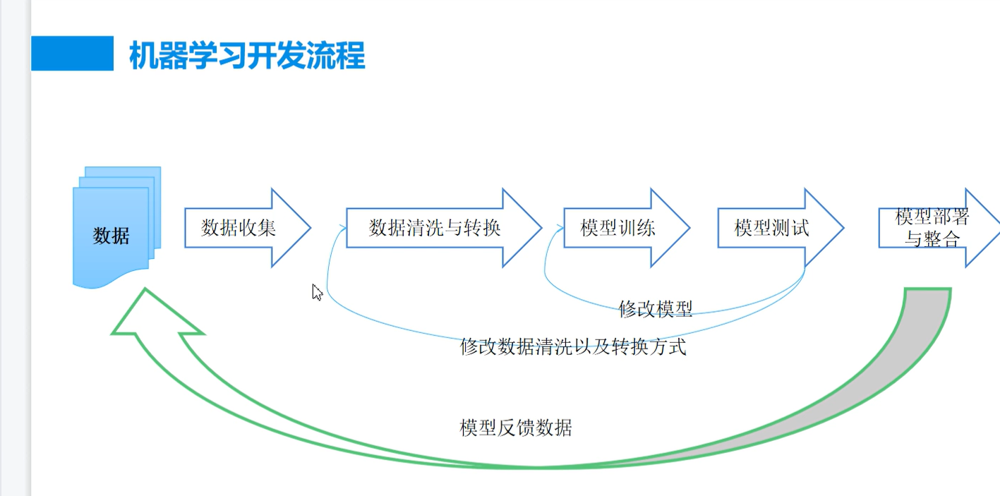
2、公开用数据集
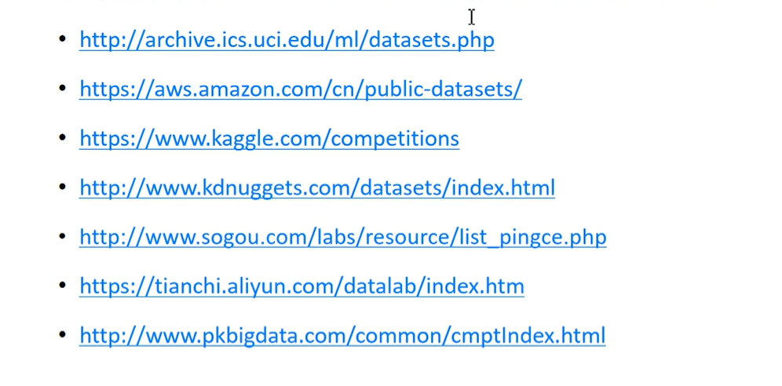
### 3、召回率和精度，调和平均值
一个数据库有500个文档，其中有50个文档符合定义。系统检索到75个文档，但是实际只有45个符合定义。则:

召回率R=45/50=90%
精度P=45/75=60%

本例中，系统检索是比较有效的，召回率为90%。但是结果有很大的噪音，有近一半的检索结果是不相关。 研究表明:在不牺牲精度的情况下，获得一个高召回率是很困难的。

对于一个检索系统来讲，召回率和精度不可能两全其美:召回率高时，精度低，精度高时，召回率低。所以常用11种召回率下11种精度的平均值来衡量一个检索系统的精度。我们也可以将这两个度量值融合成一个度量值，如F度量(F-measure)。对于搜索引擎系统来讲，因为没有一个搜索引擎系统能够搜集到所有的WEB网页，所以召回率很难计算。

调和平均值，每次购买固定金额的菜的平均数
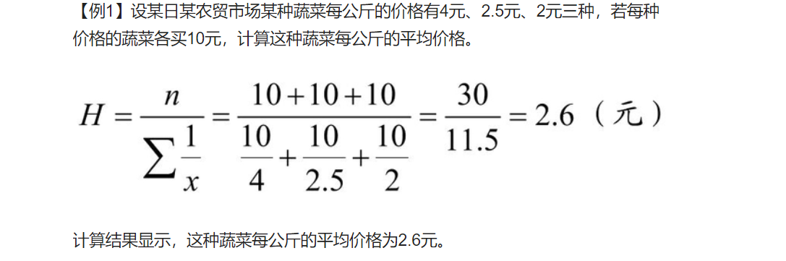
### 4、混淆矩阵：
https://blog.csdn.net/qq_34807908/article/details/82024247
https://zhuanlan.zhihu.com/p/549835162
真阳性(TP)：诊断为有，实际上也有高血压。
伪阳性（FP）：诊断为有，实际却没有高血压。
真阴性（TN）：诊断为没有，实际上也没有高血压。
伪阴性（FN）：诊断为没有，实际却有高血压。
灵敏度（Sensitivity） = TP/(TP+FN)
特异度（Specificity） = TN/(FP+TN)

真正率（TPR） = 灵敏度 = TP/(TP+FN)
假正率（FPR） = 1- 特异度 = FP/(FP+TN)
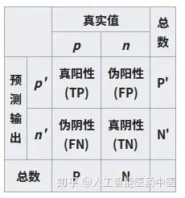

### 5、Roc曲线
ROC曲线中的主要两个指标就是真正率和假正率，上面也解释了这么选择的好处所在。其中横坐标为假正率（FPR），纵坐标为真正率（TPR），下面就是一个标准的ROC曲线图。ROC曲线的阈值问题与前面的P-R曲线类似，ROC曲线也是通过遍历所有阈值来绘制整条曲线的。如果我们不断的遍历所有阈值，预测的正样本和负样本是在不断变化的，
相应的在ROC曲线图中也会沿着曲线滑动。
如何判断ROC曲线的好坏？
**改变阈值只是不断地改变预测的正负样本数，即TPR和FPR，**
但是曲线本身是不会变的。那么如何判断一个模型的ROC曲线是好的呢？
这个还是要回归到我们的目的：FPR表示模型虚报的响应程度，而TPR表示模型预测响应的
覆盖程度。我们所希望的当然是：虚报的越少越好，覆盖的越多越好。
所以总结一下就是TPR越高，同时FPR越低（即ROC曲线越陡），那么模型的性能就越好。
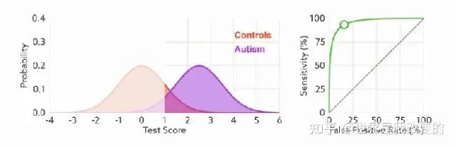
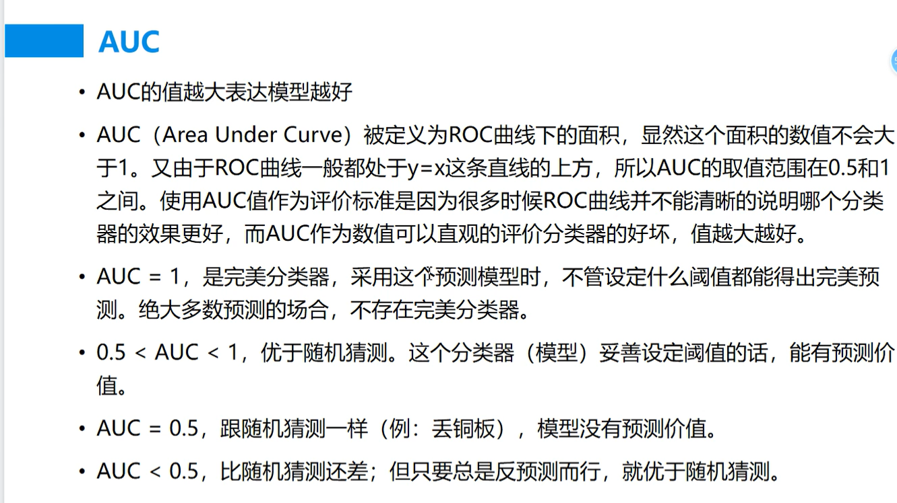

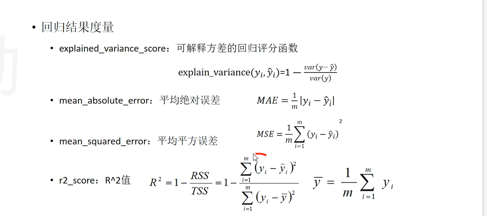
### 6、可解释方差
可解释方差(Explained Variance)是指模型的预测结果能够被模型自身解释的比例。
它是通过将观测值与模型预测值之间的差异平方和与总差异平方和之间的比例计算得出的。

在回归分析中，可解释方差指的是模型对观测值变异性的解释能力，或者说是模型的拟合程度。可解释方差越高，预测精度也越高。
例如，如果一个回归模型的可解释方差为0.8，意味着该模型可以解释80%的样本差异性，
其余20%的部分则可能由其他更加随机的因素所影响。而如果可解释方差很低，则说明模型拟合效果不够好，
可能需要考虑改进模型或者增加更多的特征。

可解释方差可以通过数据中的“平方和”(Sum of Squares)来计算，其中总平方和(Total Sum of Squares)public是每个观测值与所有样本均值的平方差的总和，可解释平方和(Explained Sum of Squares)是回归模型预测值与观测值之间的平方差的总和，
而残差平方和(Residual Sum of Squares)则表示模型无法解释的部分，是观测值与回归模型的预测值之间的平方差的总和。
假设我们正在研究身高与体重之间的关系，其中身高是自变量，体重是因变量。我们收集了10个样本数据，如下所示：

身高(cm)	体重(kg)
170	65
175	70
180	74
165	62
168	67
172	70
177	72
182	75
183	77
178	73
我们可以使用最小二乘回归线来拟合这些数据，这是一种常见的回归分析方法。这里，我们假设身高是唯一的解释因素。

一旦我们用这个模型计算出回归方程，我们就可以计算可解释方差了。假设我们的回归方程是：

体重 = 50 + 0.6*身高

基于这个方程，我们可以计算每个观测值的预测结果，并比较预测值和真实值之间的差异。然后，我们可以使用以下公式来计算总平方和、可解释平方和和残差平方和：

总平方和(Total sum of squares) = Σ(y' - y-)² 可解释平方和(Explained sum of squares) = Σ(y' - y‘¯)² 残差平方和(Residual sum of squares) = Σ(y’¯ - y)²

其中，y是实际观测值，y'是回归模型的预测值，y¯是所有观测值的均值。

通过使用上面的方程，我们可以得到下面的结果：

总平方和(TSS) = 46.0 可解释平方和(ESS) = 36.1 残差平方和(RSS) = 9.9

那么，我们可以计算可解释方差的比例：

可解释方差(Explained variance) = ESS/TSS = 36.1/46.0 ≈ 0.785 或者 78.5%

这意味着，我们的回归模型可以解释观测数据中78.5%的变异性，其余的21.5%由其他随机因素造成。

### 7、 R平方
在统计学中，R平方（R-squared）是一种用来描述一个回归模型对数据拟合程度的度量。R平方值是介于0和1之间的一个数，越接近于1，说明模型对数据的拟合越好，越接近于0，则拟合效果越差。

具体来说，R平方是用回归平方和(RSS)和总平方和(TSS)的比值来计算的。其中，回归平方和是指回归模型的预测值与实际值之间的差异的平方和，总平方和则是指实际值与其平均值之间的差异的平方和。

回归平方和可以表示为：

RSS = Σ(yi - ŷi)²

其中，yi是实际值，ŷi是回归模型的预测值。

总平方和可以表示为：

TSS = Σ(yi - y_mean)²

其中，y_mean是所有实际值的平均值。

最终，R平方可以计算为：

R² = 1 - (RSS/TSS)

或者简单地说，R平方表示回归模型可以解释的总方差占总方差的比例。例如，当R平方等于0.8时，说明模型可以解释80%的总方差，剩余20%的方差则来自其他因素。R平方的取值范围都在0到1之间，越接近于1，说明回归模型的预测效果越好，而越接近于0，则意味着模型预测效果不理想。
R平方和可解释方差是统计学中的两个不同的概念，但它们有一些相似之处，并且用途也有部分交叉。

可解释方差是指因变量的变异中可以被自变量（或预测变量）解释的部分，它体现了自变量和因变量之间的关系程度。而R平方是线性回归模型中用来衡量模型的拟合优度的指标，它描述的是模型中所有因素对回归结果的解释程度，包括自变量和其他影响因素的贡献。

在线性回归模型中，对于单个自变量和因变量之间的关系，其R平方值等于可解释方差所占比例。不过需要注意的是，R平方只适用于线性回归模型，而可解释方差则可以适用于各种类型的预测模型。

因此，虽然R平方和可解释方差并不是完全相同的概念，但它们之间有相似之处，并且通常都在评估预测模型的时候使用。通过对这两个指标的评估，我们可以了解预测模型中各个因素对预测结果的贡献程度，以及模型整体的拟合状况，为进一步分析和优化模型提供参考。

为什么会有总平方和

在统计学中，总平方和是指所有样本数据点与样本均值之间差的平方和。这个和的计算可以帮助我们了解数据集的变异情况，即数据集的变异程度，因此在数据分析中都经常会用到。

总平方和可以对总变异进行测量，它包含了因变量所有可能的变异情况，反映了因变量的综合变异程度。通过计算总平方和，我们可以了解数据样本整体的变异程度，为后续分析和建模提供重要数据基础。

在回归分析中，总平方和等于已知数据点与回归线之间的距离（或残差）的平方和再加上回归线与因变量均值之间的距离平方和。这里的因变量均值指的是将所有观测值作为一个整体，求出它们的平均值。

总平方和经常会用来计算回归分析中的R平方值和F值。R平方值用来衡量回归方程的拟合程度，F值用来比较回归方程的拟合优度和总变异的大小。因此，总平方和是回归分析中非常重要的概念之一。

### 8、KNN
KNN（K-Nearest Neighbors，最近邻居法）是一种用于分类和回归的非参数算法。给定未标记样本，KNN算法通过找到最近邻的训练样本来对其进行分类或回归预测。这里的“最近邻”指在特征空间中距离最近的训练样本，KNN算法中K代表了需要查找的最近邻的数目。

在分类问题中，对于一个未标记的样本，KNN算法会找到其最近的K个邻居（即K个最相似的样本），然后将他们的分类结果进行统计，取最高频率的类别作为该样本的预测分类。

在回归问题中，KNN算法用与分类问题相似的方法查找最近的K个邻居，并使用这些邻居的目标值的平均值来预测新样本的目标值（或进行回归分析）。

KNN算法不假设任何数据分布，是一种基于实例学习的算法。它的优点是简单易用、无需训练过程、可处理具有非线性关系的数据；但其缺点包括计算复杂度高、需要大量存储样本数据等。在实际应用中，KNN通常需要对数据预处理和优化参数选取等操作以达到更好的效果。

以下是一个使用KNN算法的简单例子：

假设有一批样本数据集，其中每个样本包括两个属性：身高和体重，以及性别，用于构建一个KNN模型，用于预测未知样本的性别。

我们随机选取10个样本，并将它们分为男女两组，样本数据如下：

身高(cm)	体重(kg)	性别
180	70	男
175	65	男
160	50	女
165	57	女
175	70	男
173	61	男
158	50	女
163	56	女
170	65	男
170	62	男
现在我们有一个未知样本：身高168cm，体重54kg，我们要通过已知样本来预测它的性别。

首先，我们需要选择一个距离度量方法，可以使用**欧氏距离**作为距离度量方法。
接下来，我们需要选择一个K值。K值代表我们需要选出几个最近邻的样本来进行预测。这里我们假设K=3。
然后，我们可以计算未知样本与所有已知样本之间的距离，然后选择距离最近的K个样本。这里我们计算出的结果如下表所示：
身高差值	体重差值	距离	性别
12	4	12.4096743	男
7	11	13.5277493	女
8	3	8.5440037	男
我们统计K个样本中每个类别出现的频率，结果显示我们选择的3个最近邻中，有2个是男性，1个是女性，因此我们预测未知样本的性别应该是男性。
以上是一个简单的KNN算法的示例，通过寻找最近邻来实现未知样本的分类预测。在实际应用中，我们需要考虑更多的参数和情况，并进行更多的数据处理和优化来优化模型的准确性。
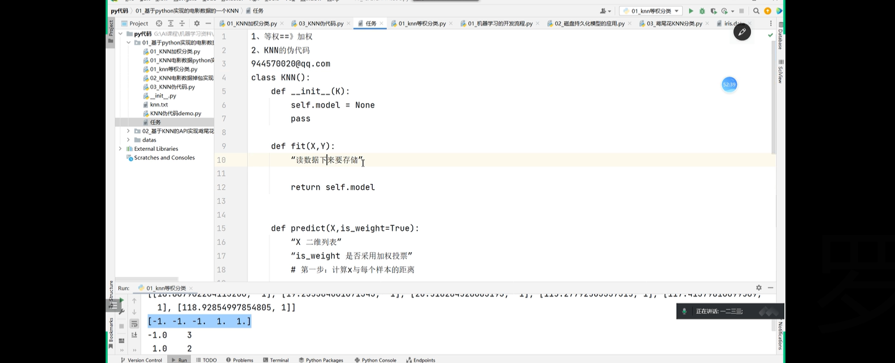
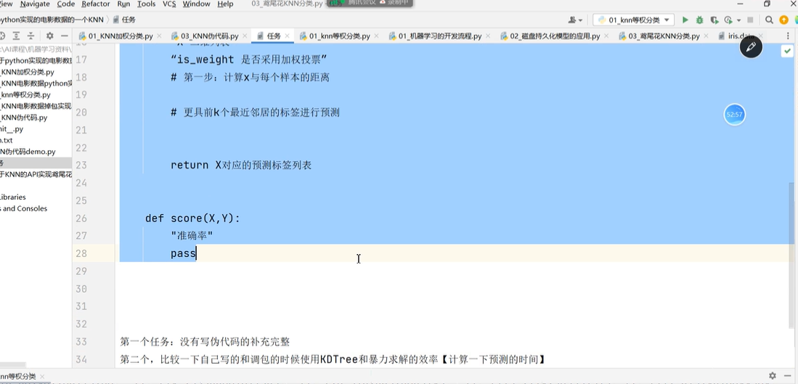

### 9、KNN三要素
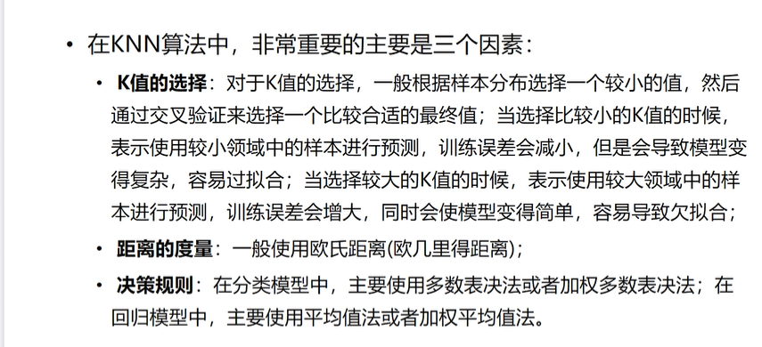
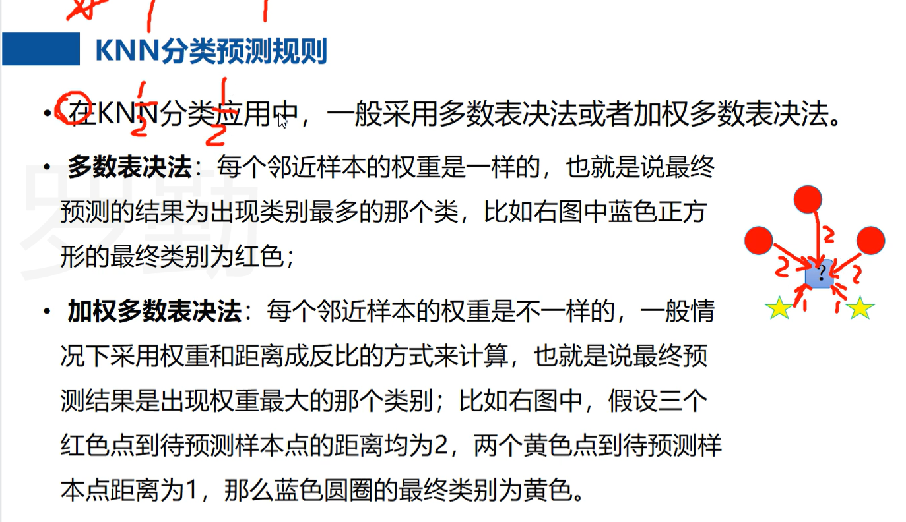 
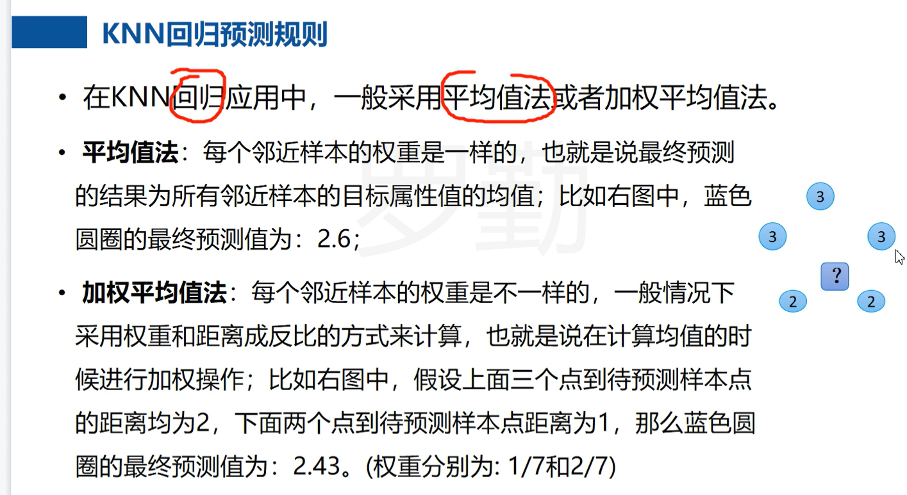
训练KNN模型需要进行特征标准化吗？

如果不进行特征标准化，那么**数值比较大的特征**可能会在计算距离时对距离的结果产生更大的影响，从而使得某些特征更为重要，或者干扰到样本的分类预测。
特征标准化后，所有特征的分布均值为0，方差为1，这样所有的特征在距离计算中所占的权重是相等的，不会因为数据量级问题导致权重失衡，同时可以减小数据的偏斜性和离群点的影响。

总之，特征标准化可以帮助KNN模型更好地建模和泛化，使得分类预测能够更准确，使得分类结果更具有可靠性。因此，在实际应用KNN模型时，执行合适的特征标准化处理是非常有必要的。

**KNN模型如何进行标准化？**
在KNN模型中对特征进行标准化的一种常见方法是使用Z-score标准化方法，即将数据进行中心化和标准化。具体步骤如下：

对于训练数据集中的每个特征，计算这个特征的平均值和标准差。
对于训练数据集中的每个样本，对该样本中的每个特征应用以下公式进行标准化：
z-score = (x - mean) / std

其中，x表示该特征的原始值，mean和std分别表示该特征的平均值和标准差。

例如，对于一个样本数据集，假设有两个特征，身高和体重。计算出身高和体重的平均值和标准差，然后对于每个样本，将身高和体重分别进行标准化，如下：

📎样本1：(180 - 174.5) / 5 = 1.1

对于测试数据集中的每个样本，对该样本中的每个特征也应用以上公式进行标准化，使用的平均值和标准差是在训练数据集中计算的相应值。
标准化之后，特征的均值为0，方差为1，使得所有的特征在距离计算中占用相同的比例，避免由于特征值大小范围不同造成数据分类偏差。

**为什么KNN模型中，K越小，模型越复杂**

K值的大小决定了计算最近邻居的数量，具体地说，K值越小，模型就越接近于邻近算法（近似数据）。对于一个特定的数据集，当K值很小和很大时，分类器的表现会变得不太好，在这种情况下，通常可以取一个合适的中间值。

当K值很小时，模型的复杂度会增加，因为它会更容易受到噪声和随机变化的干扰，使得分类结果更加不稳定。换句话说，当K值很小时，我们更关注的是数据集的局部特征，而忽略了数据整体的特征，对数据的拟合程度较弱，容易发生过拟合。

另一方面，当K值很大时，模型的复杂度会降低，因为它考虑的是更多的数据点，更关注数据集的全局特征。但是，当K值太大时也会导致一些问题，例如，模型变得难以解释，因为它可能包含过多的数据点，使得模型不再考虑数据集的局部特征，这与我们的实际情况不符。

综上所述，选择合适的K值至关重要，它会直接关系到模型的复杂度与分类效果。在实际应用中，我们通常可以通过交叉验证等方法来帮助选择最优的K值，以最大程度地提高KNN模型的表现。

**什么是标准差**

标准差是一种表示数据集合变异程度的统计量。它是方差的平方根，用来描述数据偏离平均值的程度，反映了个体间的离散程度。

标准差越大，说明数据的分散程度越大，即数据之间的差异越明显；而标准差越小，则说明样本间的离散程度越小，数据的差异越小。

在数学上，标准差的计算公式为：

标准差 = 平均数与每个数据差值平方和的平均数的平方根

标准差的值不能为负数，当标准差为0时，则说明所有数据都相等。

在统计学中，标准差是一种常用的计算方法，可以用来描述数据集的分布情况和离散程度，还可以配合均值和正态分布等概念，帮助我们深入理解和分析样本数据。

### 10、KNN算法实现方式
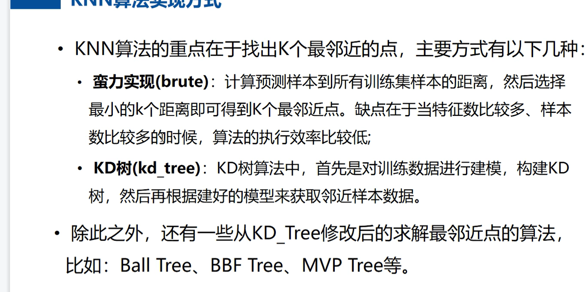
KD树是一种用于解决KNN问题的高效数据结构，它可以大幅度减少最近邻搜索（KNN搜索）的计算时间。这种数据结构可以有效地存储和处理高维数据，以便在数据集中快速查找最邻近的点。

KD树是一种平衡树，通常表示为二叉树。它的每个节点都代表一个k维空间中的点，通常选择一个特征作为分割的标准，比如取
x1
（水平分割）或 x2
（垂直分割）等。分割的过程会将空间划分成两个子空间，每个子节点代表划分出来的一个子空间。与决策树不同的是，KD树是一个树形结构，它不是一个有向无环图。

通过构建KD树，我们可以在高维数据集上快速地进行最近邻搜索。例如，对于一个待分类样本，我们可以从根节点开始递归查找其最近的邻居，直到到达叶节点为止。然后，我们将这个叶节点中的所有点与待分类样本进行比较，找到距离最近的那个点，并将其作为待分类样本的最近邻点。

总之，KD树是一种高效的数据结构，可用于快速查找高维空间中的最近邻点，适用于各种机器学习任务，比如分类、聚类、异常检测等。
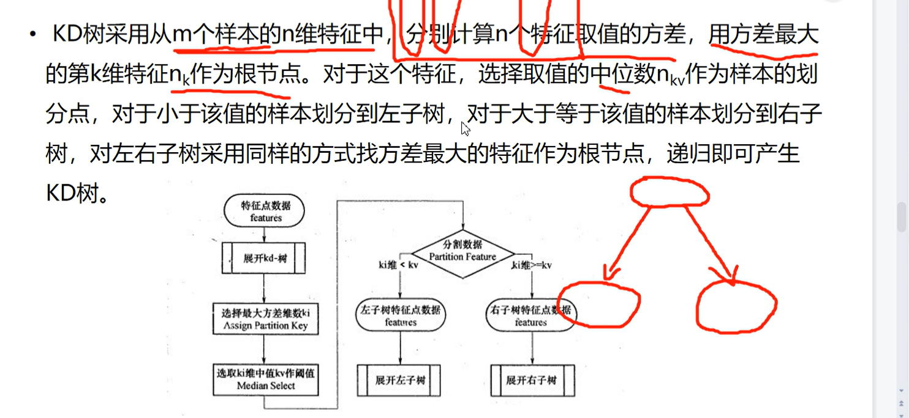
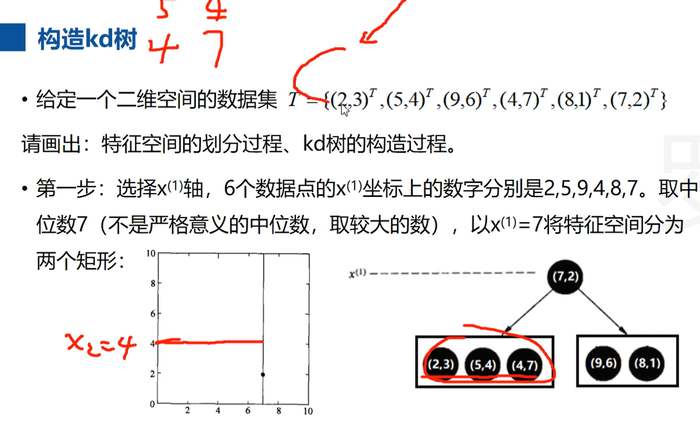

**KD树查找**
在KD树中，查找某一数据点的最近邻点通常分为两步：

遍历KD树，找到最相近的叶节点。
从最相近的叶节点开始回溯，并逐一比较节点上的数据点与目标点之间的距离，找出距离最近的那个点。
具体步骤如下：

1.从根节点开始，遍历KD树，当我们到达一个节点时，我们首先检查该节点所表示的超矩形是否与目标点的搜索半径相交。如果不相交，则跳过该节点并返回；否则，我们继续遍历。

2.当我们到达叶节点时，我们记录该节作为最近邻点，并计算该点的距离与目标点的距离。我们将这个叶节点作为当前“最优解”。

3.然后我们从这个叶节点开始向上回溯。对于每个节点:

如果节点比当前“最优解”更近，则更新当前“最优解”。
检查当前节点的另一个子节点是否有可能更近。

4.如果有可能更近，则转到该子节点并重复步骤1。

5.如果没有更接近的节点，则回溯到根节点并结束算法。

在实际应用中，还可以使用一些优化策略来加速查找过程。例如，在遍历树时，可以根据目标点和超矩形之间的距离来选择将哪个子树先遍历。这样可以逐步缩小搜索范围，从而提高查找效率。