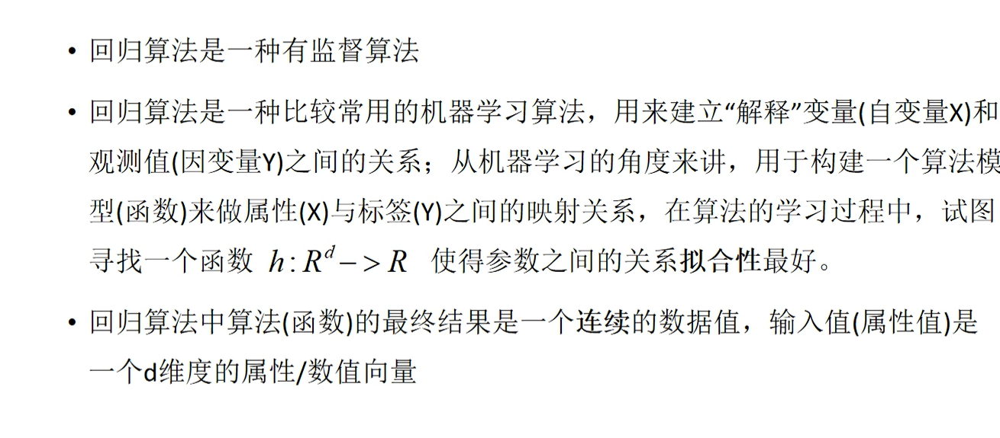
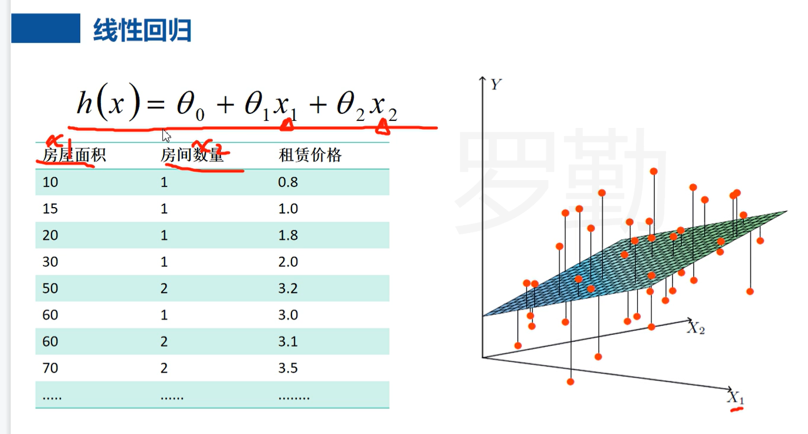
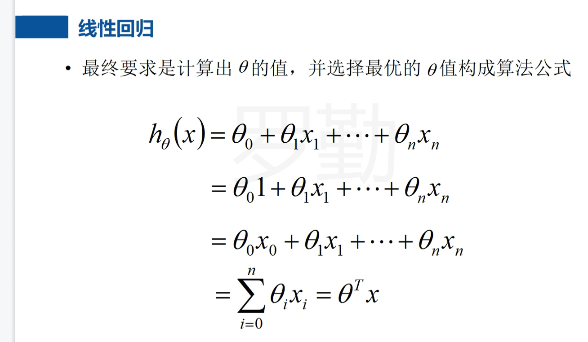
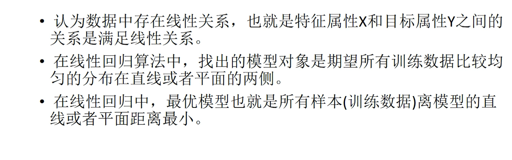
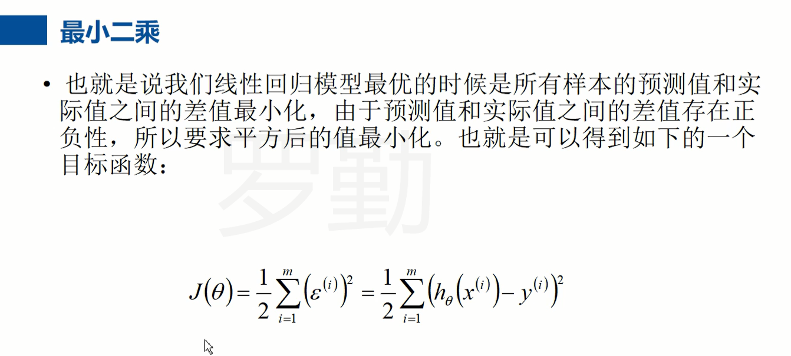
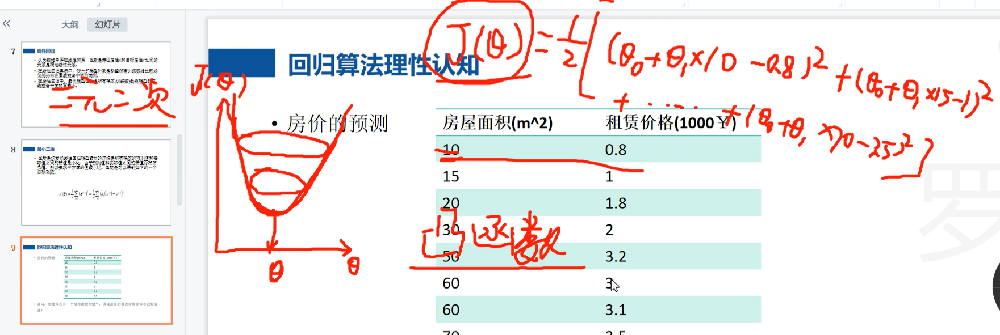
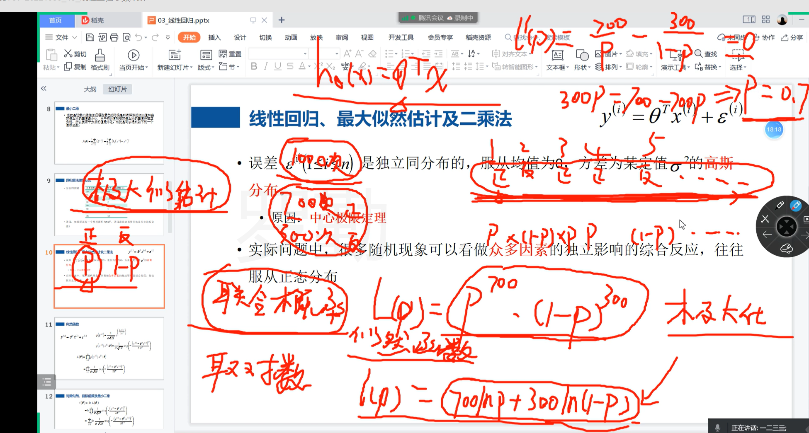
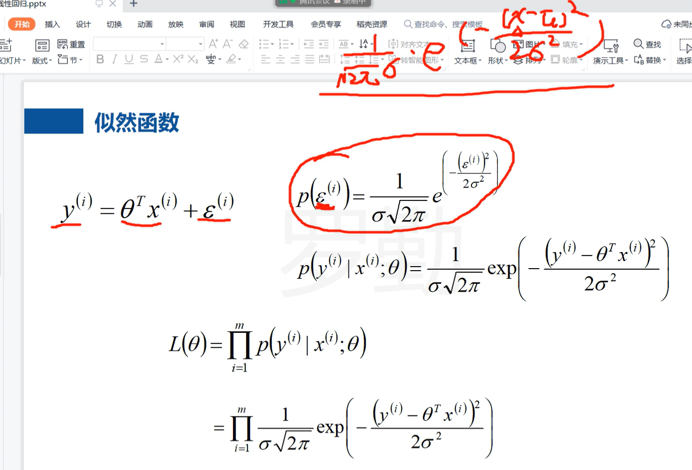

1、线性回归

行向量乘以列向量

最小二乘

最大似然估计

最大似然估计是一种参数估计方法，用于确定未知参数的最优值。其基本思想是在给定一定数量的观测值或采样数据的情况下，通过考虑该数据的生成概率，来估计出最优的模型参数值。

一般来说，在使用最大似然估计进行参数求解时，我们会定义一个概率分布模型，并假设模型中一些参数是未知的，这些参数需要根据已经观测到的数据来进行估计。

最大似然估计的过程主要包括以下几个步骤：

1、确定概率模型及其相应的参数。
2、利用已知数据估计参数，推断未知的模型参数。
3、定义损失函数或似然函数，最大化联合概率。
4、最大似然估计通常应用于各种数据建模问题，如分类、聚类、回归预测等。在实际应用中，可以使用许多不同的概率模型来拟合已知数据，如高斯分布模型、离散分布模型、混合模型等。同时，也需要根据具体应用的需求，选择合适的损失函数或似然函数，并结合合适的优化算法进行求解。
