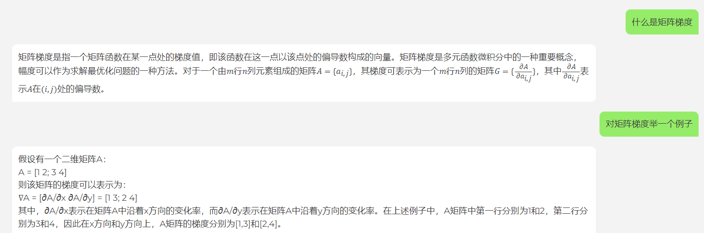
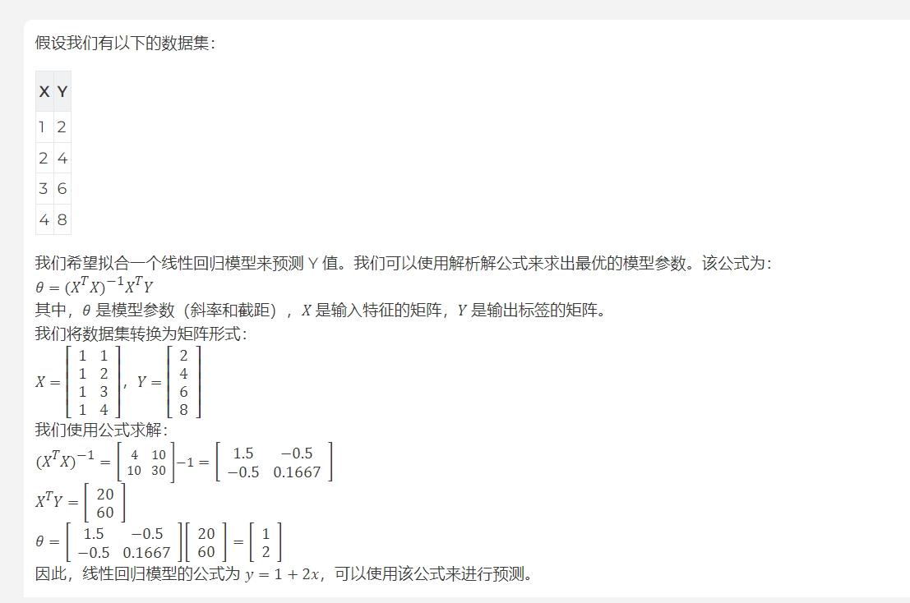
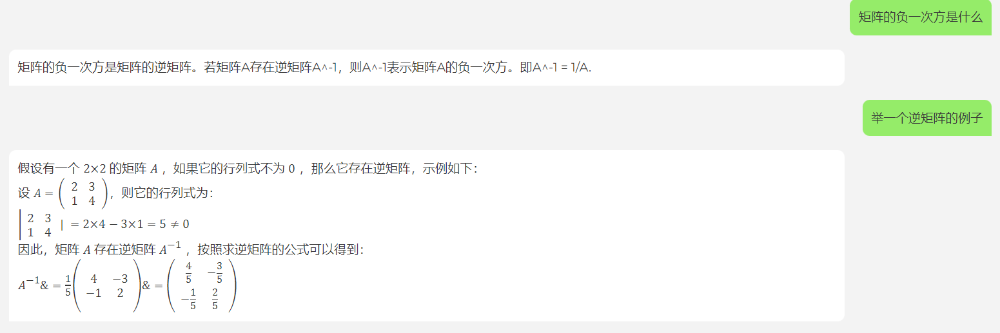

1、线性回归

行向量乘以列向量

最小二乘

最大似然估计

最大似然估计的目标是找到模型参数，使得给定数据集后，生成该数据集的概率最大。误差概率是预测结果与真实值之间的差异，因此在估计模型参数时，我们希望预测误差的概率最小化
从公式上看，误差概率与误差是相反关系

梯度

线性回归的解析解是指基于最小二乘方法，通过数学公式求得的线性回归方程参数的解析表达式。具体来说，线性回归解析解是通过对数据集进行线性拟合的过程中，通过最小化预测值与真实值之间的误差，从而得到模型的参数值的过程。

常见的线性回归解析解包括正规方程(Normal Equation)和梯度下降法(Gradient Descent)。在正规方程中，模型的参数值可以通过矩阵运算得到，而在梯度下降法中，则需要通过反复迭代来逐步调整参数值，从而使误差最小化。

线性回归的解析解具有比较高的计算效率，尤其对于小规模的数据集，它能够快速地求出最优的模型参数值。但是对于大规模的数据集而言，由于计算量较大，因此梯度下降法更加适合。

